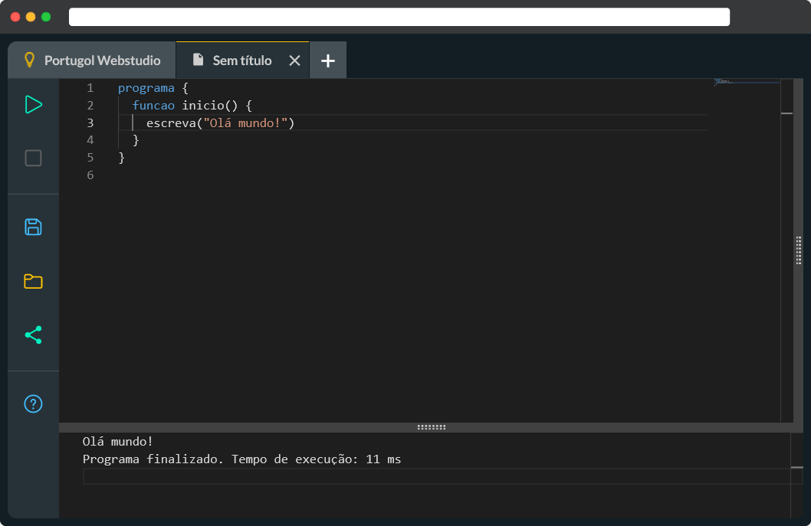

<a href="https://portugol.dev/"></a>

# Portugol Webstudio

_IDE online para o Portugol_

[](https://github.com/dgadelha/Portugol-Webstudio/blob/master/LICENSE)
[](https://github.com/dgadelha/Portugol-Webstudio/stargazers)

## Dissertação (UNIFEI) — fork `portugol-ai-tutor`

Este repositório é um **fork** de [Portugol-Webstudio](https://github.com/dgadelha/Portugol-Webstudio) usado no mestrado em Ciência e Tecnologia da Computação (UNIFEI — Itajubá), no projeto de dissertação *Orquestração de Agentes de IA com Método Socrático para o Ensino de Lógica de Programação: uma integração com o Portugol Webstudio baseada em Design Science Research* (orientação: Prof. Dr. Bruno Guazzelli Batista).

- **Autor do fork / pesquisa:** Luis Ricardo Albano Santos
- **Upstream:** `https://github.com/dgadelha/Portugol-Webstudio.git` (remote sugerido: `upstream`)
- **Backend (Azure Functions + LangGraph):** repositório companheiro [**maieutica**](https://github.com/luisricar-do/maieutica). Esta IDE inclui o tutor socrático **ARIA** em **overlay imersivo** (atalho **⌘⇧A** / **Ctrl+Shift+A** e botão na barra lateral), consumindo `/api/help/stream` em modo SSE. Quando a API sinaliza problema resolvido (`tutorMeta.suggestedConversationEnd`), a conversa é arquivada e inicia-se um fio novo, com opção de reabrir a anterior.

### Sincronizar com o upstream

```sh
git fetch upstream
git checkout develop   # ou a branch em que você trabalha
git merge upstream/main
# resolva conflitos se houver, teste com npm ci && npm run build && npm start
```

O restante deste README descreve o projeto original **Portugol Webstudio**; a licença e os créditos dos autores originais permanecem inalterados abaixo.

---

Baseado no Portugol Studio, o **Portugol Webstudio** tenta trazer todo ambiente de desenvolvimento que é possível se encontrar no desktop, para a internet. Ele constitui-se de um ambiente de desenvolvimento construído para permitir a criação e a execução dos programas escritos em Portugol, trazendo assim uma experiência o mais próxima do que você pode encontrar da IDE do Portugol Studio. Portugol, também conhecido como Português estruturado, é um pseudocódigo escrito em português.

[](https://portugol.dev/)

## Características

- Suporta abertura e escrita de arquivos `.por`
- Permite editar e executar múltiplos códigos ao mesmo tempo
- Executado no console original do Portugol com interação em tempo real
- Interface simples e idêntica ao Portugol Studio
- Código executado diretamente no navegador através de Web Workers

## Estrutura do projeto

O Portugol Webstudio é um projeto que utiliza o framework [Angular](https://angular.io/), [RxJS](https://rxjs.dev/) e [antlr4ng](https://github.com/mike-lischke/antlr4ng). Ele é dividido em 8 pacotes (disponíveis na pasta `packages`):

- `@luisricar-do/agent`: Cliente TypeScript para a API do tutor (`/api/help` e `/api/help/stream` via SSE), tipos compartilhados e normalização da URL base; usado pela IDE.
- `@luisricar-do/antlr`: Pacote que contém a gramática do Portugol e a geração do parser, lexer e visitor
- `@luisricar-do/ide`: Pacote que contém a interface do usuário
- `@luisricar-do/parser`: Pacote que contém o novo parser do Portugol, que recebe uma árvore pré-processada pelo ANTLR e a transforma em uma árvore semântica
- `@luisricar-do/resources`: Pacote que contém os recursos do Portugol, como os exemplos e a seção de ajuda
- `@luisricar-do/runner`: Pacote que executa o código gerado pelo transpilador em Web Workers, tratando entrada, saída, erros e eventos.
- `@luisricar-do/runtime`: Pacote que contém o transpilador de Portugol para JavaScript e o código de execução em _runtime_ necessário: variáveis, bibliotecas, etc.
- `@luisricar-do/worker`: Pacote que contém o código que será executado em Web Workers, que é responsável por receber o código do Portugol, e executar a verificação de erros e transpilação do código em uma _thread_ separada.

## Executando o código localmente

1. Certifique-se de possuir instalado o [Node.js LTS](https://nodejs.org/pt-br/download/)

2. Instale as dependências do projeto

```sh
npm ci
```

3. Compile os pacotes:

```sh
npm run build
```

4. Inicie o servidor de desenvolvimento:

```sh
npm start
```

Após isto, você poderá acessar a IDE em: [http://localhost:4200](http://localhost:4200)

### Tutor por IA (API [maieutica](https://github.com/luisricar-do/maieutica))

1. Siga o README do repositório **maieutica** para subir as Azure Functions localmente (por exemplo `http://localhost:7071`).
2. Na IDE, a URL da API é lida de `packages/ide/src/environments/environment.ts` (desenvolvimento) e `environment.prod.ts` (produção), propriedade **`agentApiBaseUrl`**. Deve incluir o prefixo `/api` (ex.: `http://localhost:7071/api`). Em produção, defina o valor antes do build ou via substituição de arquivo do Angular.
3. O backend deve permitir **CORS** para a origem da IDE (ver `Host.CORS` em `local.settings.json` no maieutica ou o portal Azure em produção).
4. Para compilar só o cliente HTTP do tutor: `npm run build:agent`. O `npm run build` da raiz já inclui todos os pacotes necessários para a IDE.
5. **Interface do tutor:** use **⌘⇧A** (macOS) ou **Ctrl+Shift+A** (Windows/Linux) para abrir/fechar o painel; **Esc** também fecha. O histórico mantém-se enquanto a página estiver aberta (o painel fica montado em segundo plano).

## Contribuidores

- [Douglas Gadêlha](https://github.com/dgadelha)
- [Danilo Gadêlha](https://github.com/dngadelha)
- [Laboratório de Inovação Tecnológica na Educação (LITE) da Universidade do Vale do Itajaí (UNIVALI)](https://github.com/UNIVALI-LITE)

## Sobre o Projeto

**Autores:** [Douglas Gadêlha](mailto:dgadelha@live.com) e [Danilo Gadêlha](mailto:dngadelha@outlook.com)

## Licença

    Portugol Webstudio - IDE online para o Portugol
    Copyright (C) 2025  Douglas Gadêlha, Danilo Gadêlha e contribuidores

    This program is free software: you can redistribute it and/or modify
    it under the terms of the GNU General Public License as published by
    the Free Software Foundation, either version 3 of the License, or
    (at your option) any later version.

    This program is distributed in the hope that it will be useful,
    but WITHOUT ANY WARRANTY; without even the implied warranty of
    MERCHANTABILITY or FITNESS FOR A PARTICULAR PURPOSE.  See the
    GNU General Public License for more details.

    You should have received a copy of the GNU General Public License
    along with this program.  If not, see <http://www.gnu.org/licenses/>.
